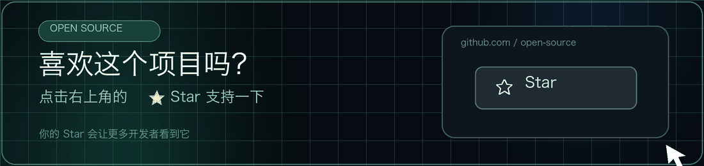

# Body Slimming Demo / 人像体型调整实验

[](https://18818474455.github.io/body-slimming-demo/)
[](LICENSE)

<p align="center">
  
</p>

一个完全在浏览器中运行的人像体型调整 Demo。项目使用 TensorFlow.js BodyPix 获得人体分割、身体部位和关键点，再使用 Canvas 位移场实现瘦身、瘦臂、瘦腿和长腿效果。

> 这是可读、可改的算法实验，效果受姿态、服装、遮挡、背景和照片构图影响，不能替代商业修图引擎。

## 在线演示

[打开 GitHub Pages Demo](https://18818474455.github.io/body-slimming-demo/)

TensorFlow.js、BodyPix 和模型文件均随仓库提供；照片在当前浏览器/设备中处理，不会由本项目上传。

## 功能

- BodyPix 17 个姿态关键点与 24 类身体部位分割
- 身体区域可视化、骨骼连接、包围盒和作用权重热力图
- 上身、手臂、大腿、小腿和腿长独立调节
- 位移场合成与双线性采样，支持原图/结果对比和 PNG 保存
- Android 端通过 ML Kit 辅助检测多人，多人场景自动禁用变形

## 算法概览

```text
输入照片
  └─ BodyPix 人体/部位分割与关键点
      └─ 计算人物中心线、区域边界与平滑权重
          └─ 合成水平收缩和垂直拉伸位移
              └─ 双线性采样得到结果图
```

项目没有使用生成式模型，也没有服务端推理。

## 本地运行

需要 Node.js 22+。

```bash
npm ci
npm run build
npm run serve
```

浏览器打开 `http://localhost:8080`。

## 打包移动应用

仓库保留 Capacitor Android/iOS 工程。修改 `docs/` 后运行：

```bash
npm ci
npm run cap:sync
npm run cap:open:android
# 或 npm run cap:open:ios
```

Android 的多人检测插件位于 `android/app/src/main/java/com/bodyslim/app/BodySlimPlugin.java`。纯网页运行时没有这个原生插件，仍可使用 BodyPix 和全部变形界面，但多人检测能力有所不同。

## 目录结构

```text
docs/                 # 静态网页、TensorFlow.js、BodyPix 和模型
android/              # Capacitor Android 工程与 ML Kit 插件
ios/                  # Capacitor iOS 工程
capacitor.config.json # Capacitor 配置
```

## 已知限制

- 面向单人、正面或轻微侧身、人物轮廓清晰的照片。
- 宽松衣物、交叉肢体、严重遮挡和多人重叠容易导致错位。
- 大强度变形可能弯曲背景直线或破坏人体比例。
- 请在取得授权后处理他人照片，并将结果明确标记为编辑图片。

## 关于未纳入的实验文件

原始工程中的 NCNN 模型和训练脚本没有被当前应用调用，且训练脚本缺少必要网络定义与数据集，无法复现。因此首个开源版本只保留可运行的 BodyPix + Canvas 主链路，避免把未验证文件包装成可用能力。

## 相关开源实验

- [Face Blemish Remover](https://github.com/18818474455/face-blemish-remover)
- [Face Age & Gender Estimation](https://github.com/18818474455/face-age-gender-estimation)
- [Liangzai](https://github.com/18818474455/liangzai) — 商业级跨平台影像处理 SDK 项目主页

## 许可证

项目自有源码使用 [MIT License](LICENSE)。随仓库提供的 TensorFlow.js、BodyPix 代码和模型，以及移动端依赖适用各自许可证或条款，详见 [THIRD_PARTY_NOTICES.md](THIRD_PARTY_NOTICES.md)。
